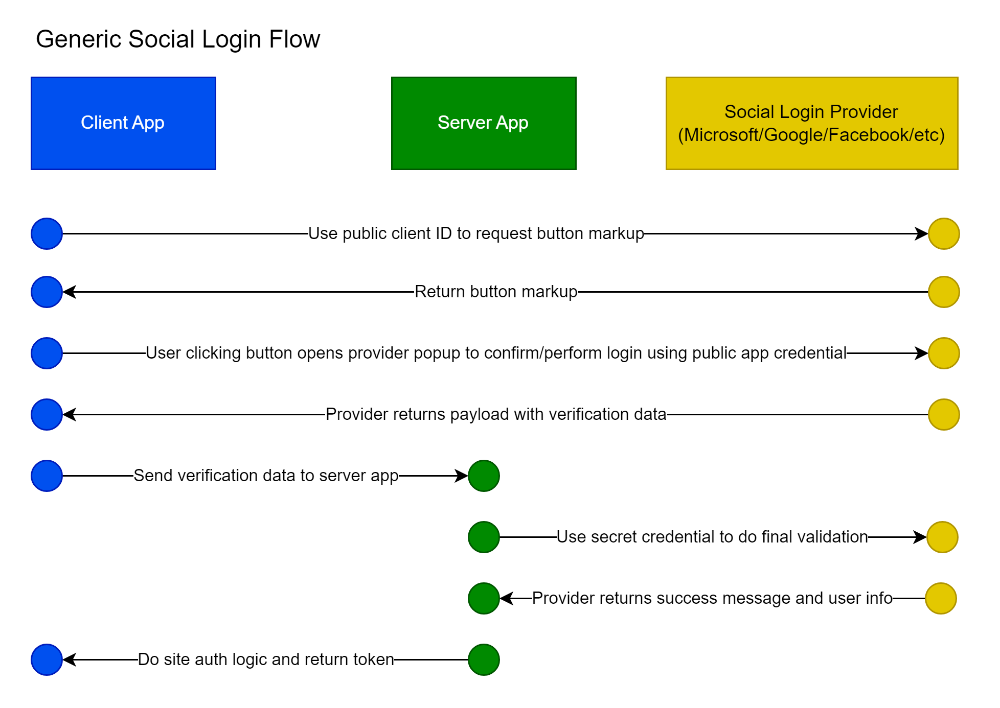

# Social Logins



## Code Locations

Application entry point `src/client/index.html` in the `<head>` section:

```html
<script src="https://accounts.google.com/gsi/client" async defer></script>
```

Button components:

- `src/client/components/auth/GoogleLoginButton.tsx`
- `src/client/components/auth/MicrosoftLoginButton.tsx`

Login page: `src/client/pages/auth/Login.tsx`

- `<GoogleLoginButton />`
- `<MicrosoftLoginButton />`

Register/sign-up page: `src/client/pages/auth/SignUp.tsx`

- `<GoogleLoginButton />`
- `<MicrosoftLoginButton />`

Environment setting: `.env`

- `GOOGLE_API_CLIENT_ID`
- `GOOGLE_API_SECRET`

Strongly typed environment setting reference: `GlobalSettings.cs`:

- `GOOGLE_API_CLIENT_ID`

Service endpoints: `WebServer/Controllers/AccountController.cs`:

- `LoginGoogle`
- `LoginMicrosoft`
- `MicrosoftLoginRedirect`

## Account Setup

These UI's change from time to time so this might not be exactly how to do it, but it should be similar.

### Microsoft Social Login Account Setup

Azure -> App Registrations

Important fields:

- Branding and properties: Publisher domain
- Authentication
  - Add Web. Examples:
    - https://local.drs.mikeyt.net.com:3000/api/account/microsoft-login-redirect-web
    - https://drs.mikeyt.net/api/account/microsoft-login-redirect-web
  - Add SPA. Examples:
    - https://drs.mikeyt.net/api/account/microsoft-login-redirect
    - https://local.drs.mikeyt.net:3000/api/account/microsoft-login-redirect
  - Supported account types: "Accounts in any organizational directory"
  - "Live SDK support": Yes
  - "Allow public client flows": No
- API Permissions
  - Microsoft Graph User.Read

Other notes:

- A verified domain is required to get this working in production for all users rather than just test users (see the Branding and properties page -> publisher domain)

### Google Social Login Account Setup

Google developer console

- Create a project
- Create an OAuth 2.0 credential
- Add all appropriate javascript origins, including ports for local development. Examples:
  - https://local.drs.mikeyt.net
  - https://local.drs.mikeyt.net:3000
  - https://drs.mikeyt.net
- In OAuth consent screen there is an "edit app" button, be sure to set "Your non-sensitive scopes" to have .../auth/userinfo.email, .../auth/userinfo.profile and openid

Code required:

- Index.html (or other application entry point): <script src="https://accounts.google.com/gsi/client" async defer></script>
